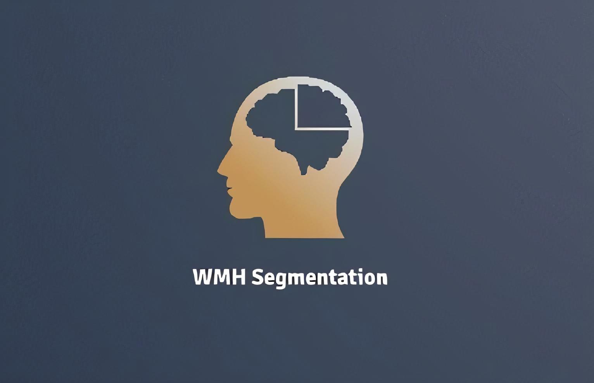

<!-- PROJECT LOGO -->
<br />
<p align="center">
  <a href="https://github.com/CRAI-OUS/WMH-Segmentation_Production">
    
  </a>

  <p align="center">
    WMH segmentation using FLAIR.
    <br />
    <a href="https://arxiv.org/abs/2207.08467"><strong>Research article »</strong></a><br>
    <br />
    <br />
    <a href="https://github.com/MartinRovang/WMH_segmentation/issues">Report Bug</a>
    ·
    <a href="https://github.com/MartinRovang/WMH_segmentation/issues">Request Feature</a>
  </p>
</p>

Weights can be recived on request.

### Run on your own computer

#### 1. Clone repo.

#### 2. Change directory to repo.

#### 3. Add datafolder in current format;
```
-alldata
  --ID1
    ---annot.nii.gz
    ---FLAIR.nii.gz
  --ID2
    ---annot.nii.gz
    ---FLAIR.nii.gz
  --ID3
    ---annot.nii.gz
    ---FLAIR.nii.gz
...
```
#### 4. Run command `docker build -t WMHSEG `. 

#### 5. Run command  `docker run -it --gpus all --shm-size=8g --ulimit memlock=-1 --ulimit stack=67108864  --rm -v ${PWD}/:/workspace wmh:latest /bin/bash`.

#### 6. Run command  `cd /workspace`.

# For training (Needs scanner datafile)

#### 1. Run command  `cd /2_5DWMHSEG_TRAIN`.
#### 2. Change the conf/config.yaml file.
#### 3. Run command  `python main.py`.

# For prediction (Needs weight file)
#### 1. Run command  `cd /2_5DSEG_PRED`.
#### 2. Change config.yaml file.
#### 1. Run command  `python main_prediction.py`.


# Test results

```
AVG Dice,                0.70 +/- 0.13

AVG HD,                  17.02 +/- 15.96

AVG AVD,                 45 +/- 51.00 

AVG Lesion detection,    0.50 +/- 0.18

AVG Lesion F1',          0.59 +/- 0.13 
```

The other models used:

nnU-Net -> https://catalog.ngc.nvidia.com/orgs/nvidia/resources/nnunet_for_pytorch (Achieved best results)

Deep Bayesian Networks (Hypermapp3r) -> https://hypermapp3r.readthedocs.io/en/latest/
